<p align="center">
  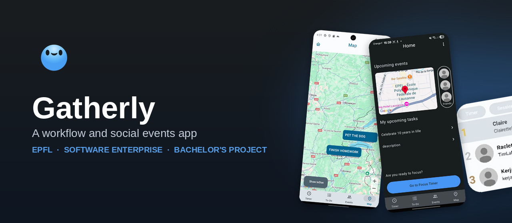
</p>

<p align="center">
  
  
  
  
  
</p>

<p align="center">
  
  
  
</p>

<p align="center">
  Gatherly blends a personal productivity toolkit with social event coordination,<br>
  built over 10 sprints by a team of 7 for EPFL's <strong>Software Enterprise</strong> (CS-311) Bachelor's project.
</p>

---

## Table of Contents

- [About](#about)
- [Features](#features)
- [Tech Stack](#tech-stack)
- [Team & Process](#team--process)
- [Getting Started](#getting-started)
- [License](#license)

---

## About

Arriving at EPFL can be complicated: you might not have built working habits, nor connected with friends to work with, or you might be overwhelmed by the number of tasks to do.

Gatherly aims to help you achieve your academic goals by connecting you with people who are looking for study groups or friends, while encouraging you to focus without being distracted by your phone, thanks to a timer that rewards you the more time you spend focusing, plus a to-do list to keep it all organized. **Manage your workflow and your social circle!**

The project was built from scratch over a single semester by **Team 22** (7 engineers), following Scrum, with weekly retros and a fully cloud-synced backend on Firebase.

---

## Features

<table>
<tr>
<td align="center" width="20%">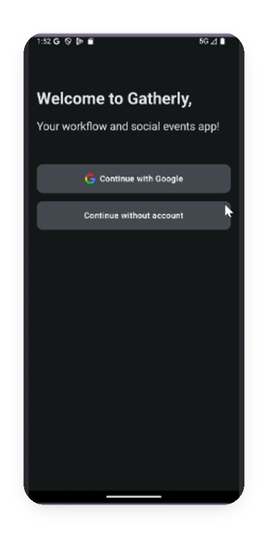<br><sub><b>🔐 Sign in, your way</b><br>Google sync or anonymous - your call</sub></td>
<td align="center" width="20%">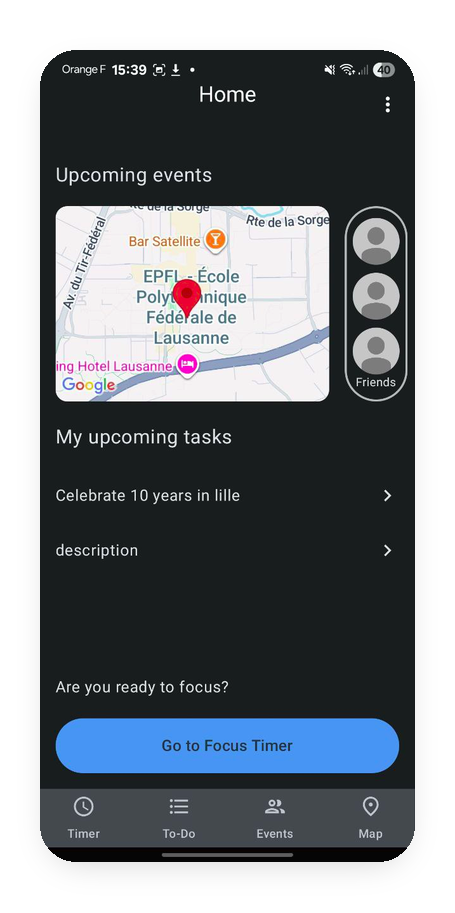<br><sub><b>🏠 Home</b><br>Upcoming events, tasks, and friends at a glance</sub></td>
<td align="center" width="20%">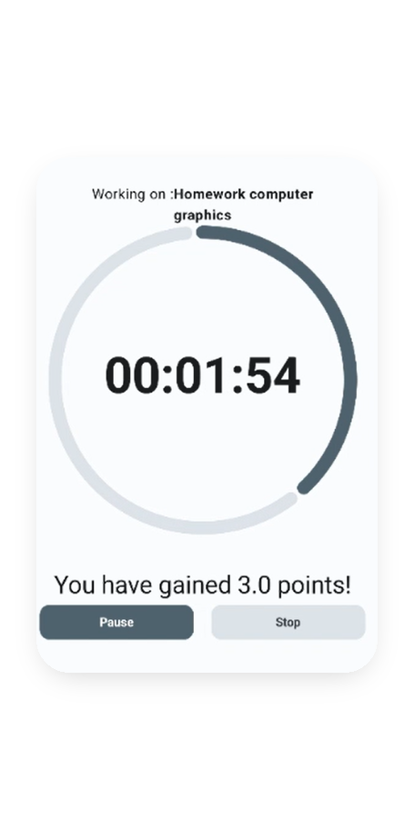<br><sub><b>⏱️ Focus Timer</b><br>Turn deep work into focus points</sub></td>
<td align="center" width="20%">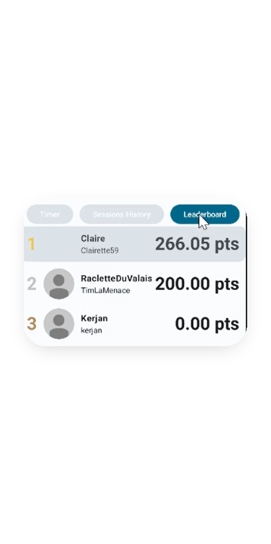<br><sub><b>🏆 Leaderboard</b><br>Friendly competition, ranked by focus</sub></td>
<td align="center" width="20%">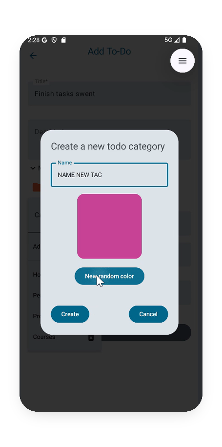<br><sub><b>✅ To-Do Lists</b><br>Color-coded, never untangled</sub></td>
</tr>
<tr>
<td align="center" width="20%">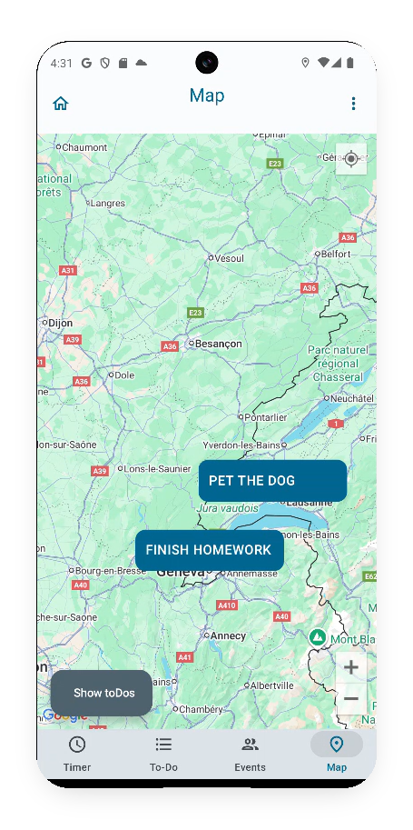<br><sub><b>🗺️ Map</b><br>Events and tasks, mapped to you</sub></td>
<td align="center" width="20%">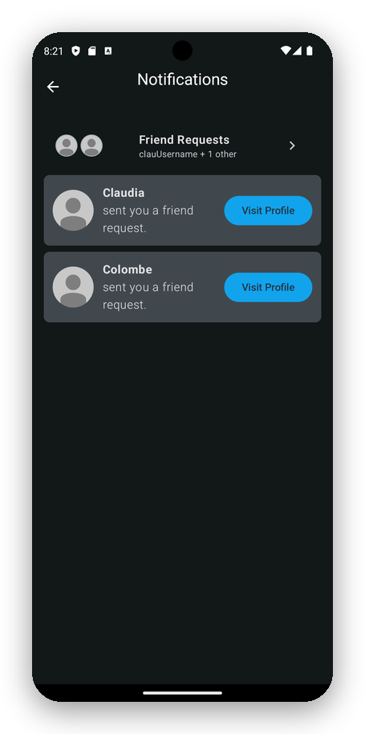<br><sub><b>🔔 Friends &amp; Notifications</b><br>Build your circle, stay in the loop</sub></td>
<td align="center" width="20%">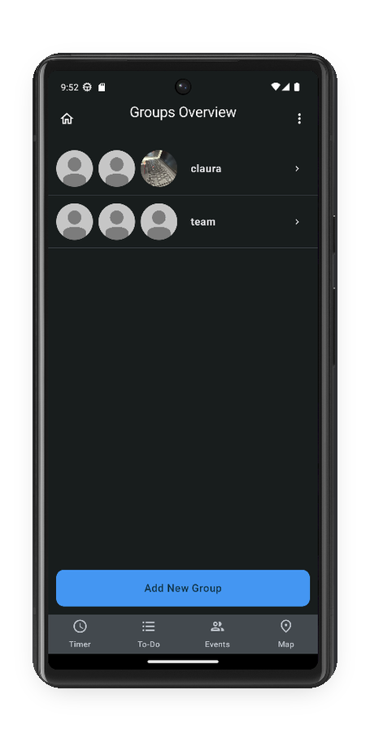<br><sub><b>👥 Groups</b><br>Bundle friends for private events</sub></td>
<td align="center" width="20%">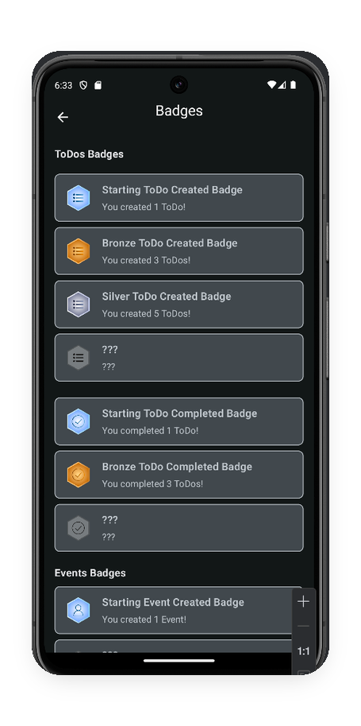<br><sub><b>🥇 Badges</b><br>Unlock achievements as you use the app</sub></td>
<td align="center" width="20%">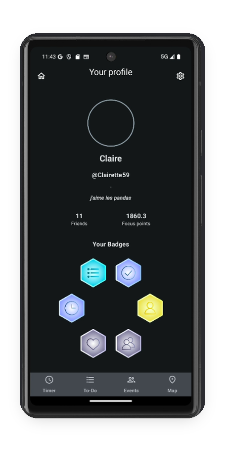<br><sub><b>👤 Profile &amp; Settings</b><br>Personal profile with focus points and badges</sub></td>
</tr>
</table>

---

## Tech Stack

| Layer | Technology |
|---|---|
| Language | **Kotlin** |
| UI | **Jetpack Compose**, following Material UI/UX guidelines |
| Backend | **Firebase Firestore** - authentication, cloud storage, real-time sync |
| Cloud Functions | **Firebase Cloud Functions** (JavaScript) - scheduled weekly leaderboard resets and focus point rewards |
| Design | **Figma** wireframes + architecture diagrams, evolved alongside each feature |
| Collaboration | GitHub workflows with mandatory peer code review on every PR |

---

## Team & Process

**Team 22** - Claire Chaffard, Alessandro Cioffi, Colombe Jourdan, Claudia Jovignot-Puerto, Gersende Kerjan, Mohamed Kharrat, Gabriel Pineda Serna

- Working collaboratively under **Scrum**
- Weekly Scrum meetings, plus stand-ups twice a week
- Work planned and tracked on a Scrum board across **10 sprints** (Sep 29 → Dec 18)
- Every change merged through a GitHub PR with mandatory peer review

---

## Getting Started

```bash
git clone https://github.com/SwentProj2025/gatherly.git
```

1. Open the project in **Android Studio**.
2. Add your own `google-services.json` (Firebase project config) to the app module.
3. Let Gradle sync, then run on an emulator or physical device.

---

## License

This project is licensed under the **MIT License** - see [LICENSE](LICENSE) for details.

---

<p align="center"><sub>Built with 💙 at EPFL.</sub></p>
